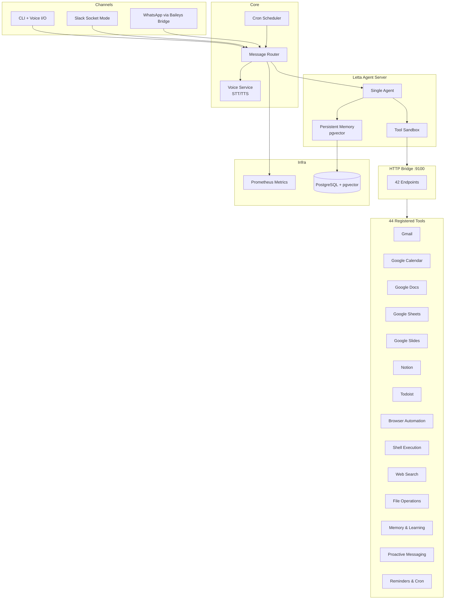
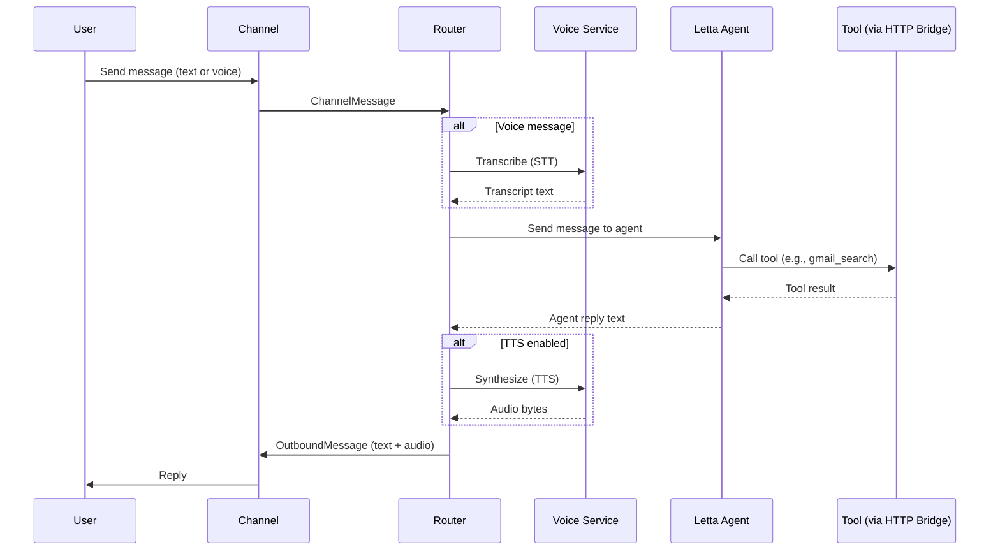
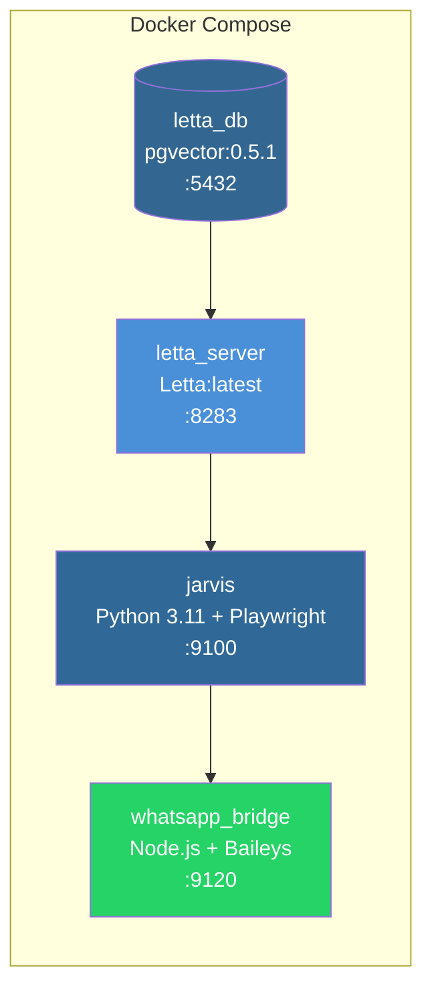

# Jarvis

A personal AI assistant built on [Letta](https://github.com/letta-ai/letta) with persistent memory, multi-channel messaging, and deep productivity tool integrations.

Jarvis lives where you do — Slack, WhatsApp, and the terminal. It manages your email, calendar, documents, tasks, and can browse the web or run shell commands on your behalf. Voice notes work too.

## Architecture



### Message Flow



### Docker Deployment



## Features

### Channels
- **CLI** — Interactive terminal with optional voice I/O (mic recording + audio playback via sounddevice)
- **Slack** — Socket Mode (no public URL needed). Handles text + audio clips
- **WhatsApp** — Via custom Node.js Baileys bridge. Voice notes (OGG/Opus) supported

### Productivity Tools (44 total)
- **Gmail** — Search, read, send, draft emails
- **Google Calendar** — List, create, update, delete events
- **Google Docs** — Create, read, append, list documents
- **Google Sheets** — Create, read, append, list spreadsheets
- **Google Slides** — Create, read, add slides, list presentations
- **Notion** — Search, read, create, update pages and databases
- **Todoist** — List, create, complete, delete tasks
- **Browser** — Navigate, extract text, take screenshots (Playwright + Chromium)
- **Shell** — Execute commands with env var filtering and timeout
- **Web Search** — Via Tavily API
- **File Operations** — Read and write files

### Agent Intelligence
- **Persistent Memory** — Letta (MemGPT) with pgvector archival memory. Self-editing core memory blocks
- **Proactive Messaging** — Agent can send unprompted messages to any channel/user
- **Cron Scheduling** — Reminders and recurring jobs via APScheduler
- **Memory & Learning** — Usage stats collection, pattern learning cycle

### Voice
- **STT** — OpenAI Whisper (`whisper-1`)
- **TTS** — OpenAI TTS (`tts-1`, Nova voice, OGG/Opus output)
- **Modes** — `auto` (voice reply only for voice input), `always`, `never`

### Observability
- **Prometheus Metrics** — HTTP request duration, message counts, tool invocations, error rates
- **Structured Logging** — structlog with ISO timestamps, console or JSON output
- **Health Endpoint** — `/health` with Letta connectivity check

## Quickstart

### Prerequisites
- Python 3.11+
- [uv](https://docs.astral.sh/uv/) (package manager)
- Docker & Docker Compose
- API keys: OpenAI, Anthropic (or Google), plus any integrations you want

### 1. Clone and install

```bash
git clone https://github.com/kar-ganap/jarvis.git
cd jarvis
uv sync
```

### 2. Configure environment

```bash
cp .env.example .env
# Edit .env with your API keys
```

### 3. Set up Google OAuth (for Gmail, Calendar, Docs, Sheets, Slides)

```bash
# Place your GCP OAuth client credentials at gcp_oauth_client_id.json
uv run python scripts/setup_google_oauth.py
```

### 4. Start with Docker

```bash
docker compose up -d          # Start all 4 services
docker compose logs -f jarvis # Watch logs
```

Or run locally (requires a Letta server already running):

```bash
set -a && source .env && set +a
uv run python -m jarvis
```

### 5. Seed the agent

```bash
uv run python scripts/seed_agent.py
```

## Configuration

Configuration lives in `config/jarvis.yaml` (local) or `config/jarvis-docker.yaml` (Docker). Key sections:

```yaml
agent:
  name: "jarvis"
  model: "openai/gpt-5.2"        # LLM provider/model

slack:
  enabled: true                    # Socket Mode

whatsapp:
  enabled: true
  bridge_url: "http://localhost:9120"
  allow_groups: false

voice:
  enabled: false                   # Enable STT/TTS
  tts_mode: "auto"                 # auto | always | never

monitoring:
  metrics_enabled: true
  log_format: "console"            # console | json
```

All sensitive values (API keys, tokens) come from environment variables, not the YAML file.

## Development

```bash
make test          # Run unit tests (287 tests)
make test-all      # Run all tests including integration
make lint          # Ruff linting
make typecheck     # mypy strict mode
make run           # Run locally
make docker-build  # Build Docker image
make docker-up     # Start all services
```

### Project Structure

```
jarvis/
├── src/jarvis/
│   ├── channels/       # CLI, Slack, WhatsApp + base ABC
│   ├── tools/          # 17 tool modules (44 functions)
│   ├── google/         # Gmail, Calendar, Docs, Sheets, Slides handlers
│   ├── notion/         # Notion API handlers
│   ├── todoist/        # Todoist API handlers
│   ├── browser/        # Playwright automation
│   ├── voice/          # STT/TTS service
│   ├── memory/         # Learning cycle
│   ├── scheduler/      # APScheduler engine
│   ├── monitoring/     # Prometheus metrics, middleware
│   ├── agent/          # Persona, Letta helpers
│   └── http_server.py  # 42-endpoint internal bridge
├── tests/              # 303 tests (287 unit + 16 integration)
├── bridge/whatsapp/    # Node.js Baileys bridge
├── config/             # YAML configuration
├── scripts/            # Setup and validation scripts
├── Dockerfile          # Multi-stage Python + Playwright
└── docker-compose.yml  # 4 services with health checks
```

## Tech Stack

| Component | Technology |
|-----------|------------|
| Language | Python 3.11+ |
| Package manager | uv |
| Agent framework | Letta (self-hosted) |
| LLM | Configurable — OpenAI, Anthropic, or Google via Letta |
| Database | PostgreSQL + pgvector |
| Testing | pytest, pytest-asyncio |
| Linting | ruff, mypy (strict) |
| Logging | structlog |
| Metrics | prometheus-client |
| Browser | Playwright + Chromium |
| Voice | OpenAI Whisper + TTS |
| WhatsApp | Baileys (Node.js bridge) |
| Slack | slack-bolt (Socket Mode) |

## Security

Phase 11 added security hardening for safer deployment:

- **HTTP Bearer Token Auth** — All 42 bridge endpoints require `Authorization: Bearer <token>` when `auth_token` is set. `/health` and `/metrics` are exempt.
- **Shell Command Safety** — Blocked pattern filter rejects destructive commands (`rm -rf`, fork bombs, device writes, `mkfs`, `shutdown`).
- **WhatsApp Sender Allowlist** — Restrict which phone numbers can message Jarvis. Empty list allows all.
- **File Path Sandboxing** — All file read/write operations are jailed to the home directory. Path traversal is blocked.
- **Browser SSRF Prevention** — URL validation blocks `file://`, `localhost`, private IPs (`10.*`, `172.16-31.*`, `192.168.*`, `169.254.169.254`).
- **Docker Hardening** — Database port no longer exposed. Request body size capped at 2 MB. WhatsApp audio capped at ~5 MB.
- **Graceful Shutdown** — SIGTERM triggers clean shutdown of all services.

See `docs/desiderata.md` for project principles and `CLAUDE.md` for development conventions.

## License

MIT
