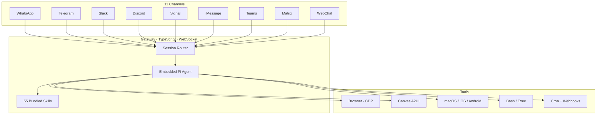
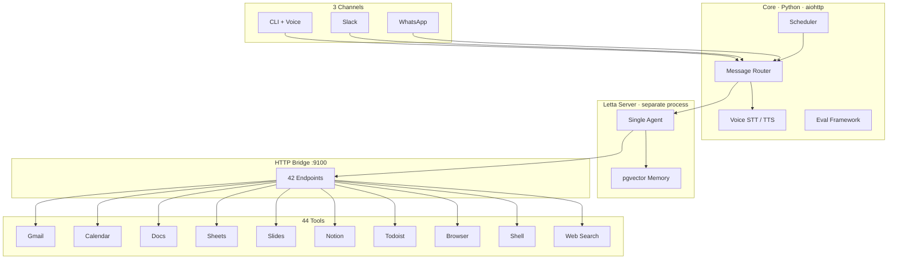

# Jarvis — GitHub & Architecture Overview

## GitHub Repo

**Description:**
> Personal AI assistant on Letta with persistent memory, multi-channel presence (CLI, Slack, WhatsApp), voice I/O, and 44 productivity tools — Gmail, Calendar, Docs, Sheets, Slides, Notion, Todoist, browser automation (Playwright), web search, and shell. Eval framework with live stability benchmarks.

**Tags:** `ai-assistant` `letta` `memgpt` `personal-assistant` `slack-bot` `whatsapp-bot` `voice-assistant` `openai` `productivity` `google-workspace` `notion` `todoist` `playwright` `docker` `prometheus`

---

## Architecture Comparison: OpenClaw vs Jarvis

### OpenClaw (upstream)

### Jarvis (fork)

### Side-by-Side

| | **OpenClaw** | **Jarvis** |
|---|---|---|
| **Language** | TypeScript | Python |
| **Agent** | Embedded Pi (in-process) | Letta server (separate process) |
| **Memory** | Skill-driven, session JSONL | pgvector embeddings + self-editing blocks |
| **Transport** | WebSocket JSON-RPC | HTTP bridge (REST) |
| **Channels** | 11 (incl. iMessage, Signal, Teams) | 3 (CLI, Slack, WhatsApp) |
| **Tools** | ~15 core + 55 skills | 44 registered functions |
| **Integrations** | Browser, Canvas, mobile nodes | Gmail, Calendar, Docs, Sheets, Slides, Notion, Todoist, Browser (Playwright), Web Search |
| **Security** | Sandbox mode for non-main sessions | Bearer token auth, shell command filter, file path sandboxing, SSRF prevention, sender allowlist |
| **Evals** | — | 20 scenarios, 10-run stability (86% acc) |
| **Deployment** | Single gateway binary | Docker Compose (4 services) |

### The Fork Story

Jarvis was built from scratch, inspired by OpenClaw's architecture. OpenClaw is excellent at what it does — 11 channels, a plugin system, mobile device control. If you need a chat-first agent that works everywhere, use OpenClaw.

Jarvis is for a different problem: I wanted an assistant that actually manages my day. Search Gmail, create a calendar event from what it finds, draft a follow-up doc, add tasks to Todoist — all in one conversation, and remember my preferences next time. That required deep API integrations (not just browser automation), persistent vector memory (not session logs), security hardening so the agent can't `rm -rf` your home directory or hit internal services, and an eval framework so I could tell whether it was actually working or just looking like it was.

The tradeoff is real: 3 channels instead of 11, Python instead of TypeScript, 4 Docker services instead of one binary. If that fits your workflow, give it a try.
